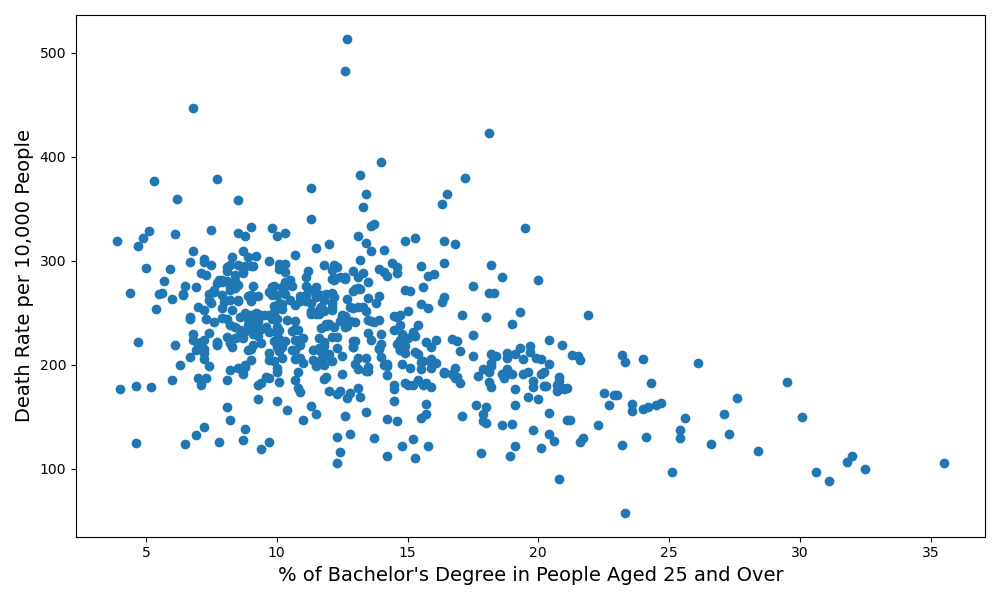

# About The Project
> GitHub README file includes a concise project overview (2 points).

This project performs an exploratory data analysis on a Kaggle dataset that includeds an abundant set of socioeconomic and demographic factors.
The analysis will examine how these factors influence health outcomes.

# Getting Started
> GitHub README file includes detailed usage and installation instructions (2 points).

## Installation

### For Unix (Linux/MacOS)

1. Open your terminal.
2. Run the following command:
```bash
git clone https://github.com/jordanskesner/plotters-against-cancer.git
```

## Usage
1. Start Jupyter Notebook from the project directory.
2. Open the relevant `.ipynb` notebook files to explore and run the analysis.

# Findings
> GitHub README includes either examples of the application, or the results and a summary of the analysis

1. The cancer mortality rate shows a moderate negative correlation with the percentage of people over 25 who hold a Bachelor's degree.



# Acknowledgments

This project utilizes the [Uncovering Trends in Health Outcomes and Socioeconomic Factors dataset](https://www.kaggle.com/datasets/thedevastator/uncovering-trends-in-health-outcomes-and-socioec/data) available on Kaggle.

Most of the data preparation process can be viewed [here](https://data.world/nrippner/cancer-trials).

# Contributors


