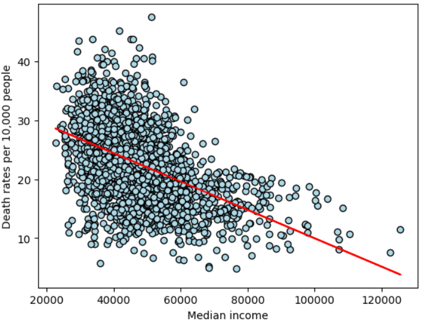
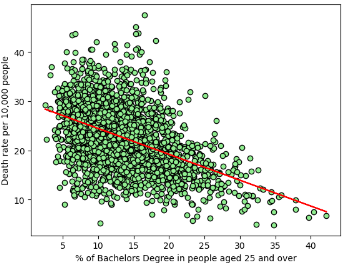
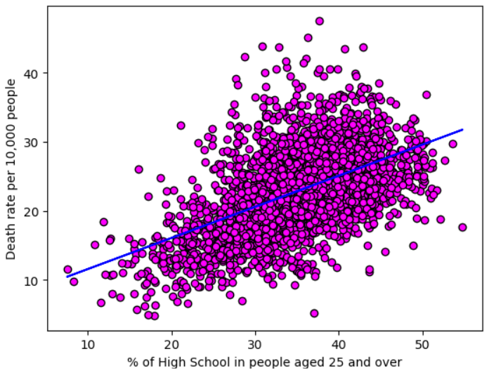
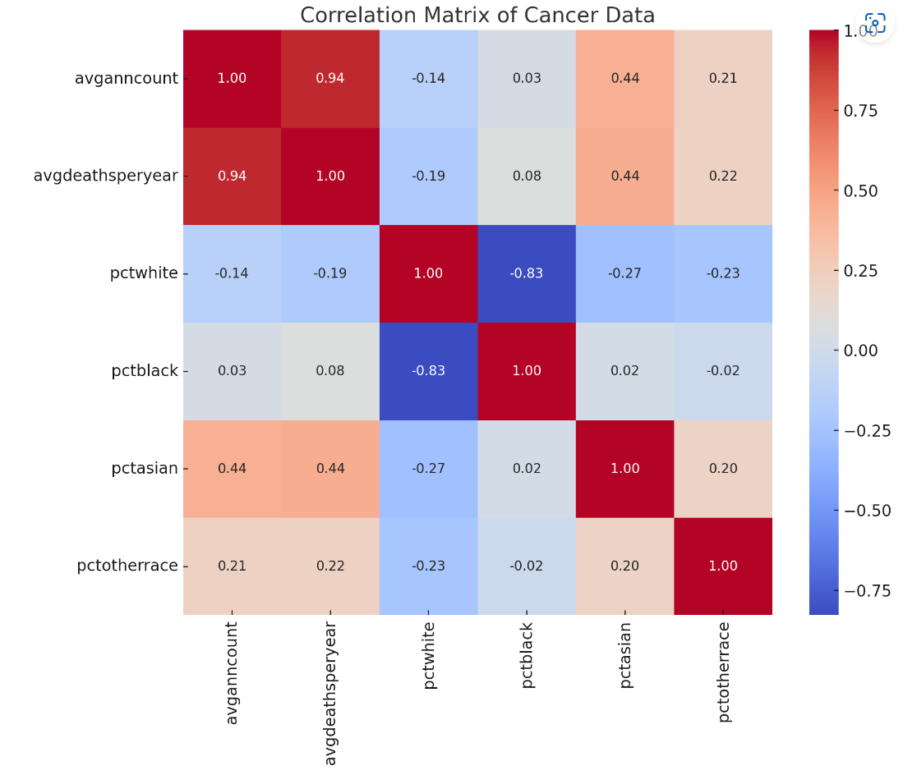

# About The Project

This project performs an exploratory data analysis on a Kaggle dataset that includeds an abundant set of socioeconomic and demographic factors.
The analysis will examine how these factors influence health outcomes.

# Getting Started

## Installation

### For Unix (Linux/MacOS)

1. Open your terminal.
2. Run the following command:
```bash
git clone https://github.com/jordanskesner/plotters-against-cancer.git
```

## Usage
1. Start Jupyter Notebook from the project directory.
2. Open the relevant `.ipynb` notebook files to explore and run the analysis.

# Findings

1. Populations with higher median income have lower death rates.


2. Populations that have a greater percentage of people over 25 with a Bachelor's degree will see lower percentage of cancer deaths. The reverse is also moderately true. Populations that have a greater percentage of people over 25 with only a high school degree will see higher percentage of cancer deaths.



3. The South exhibits the highest cancer mortality rates across the United States.


4. Insurance coverage types may have a significant impact on cancer death rates, with public insurance showing a stronger positive correlation with higher cancer death rates.


5. The number of clinical trials per capita has a weak correlation with cancer statistics, suggesting that other factors may play a more significant role in influencing cancer outcomes.


6. There is a strong correlation between cancer incidence and median age, with a correlation coefficient of 0.63 overall, 0.59 for median male age, and 0.62 for median female age.


7. (GPT) There are varying correlations between average annual cancer count and racial demographics: a weak negative correlation of -0.14 with the percentage of the White population, a very weak positive correlation of 0.03 with the percentage of the Black population, a moderate positive correlation of 0.44 with the percentage of the Asian population, and a weak positive correlation of 0.21 with the percentage of other races.



# Acknowledgments

This project utilizes the [Uncovering Trends in Health Outcomes and Socioeconomic Factors dataset](https://www.kaggle.com/datasets/thedevastator/uncovering-trends-in-health-outcomes-and-socioec/data) available on Kaggle.

Most of the data preparation process can be viewed [here](https://data.world/nrippner/cancer-trials).

# Contributors


