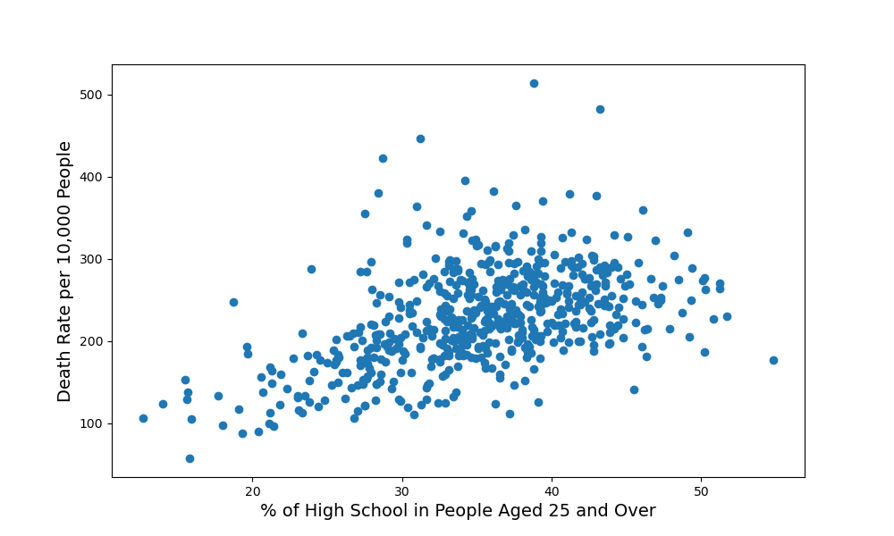
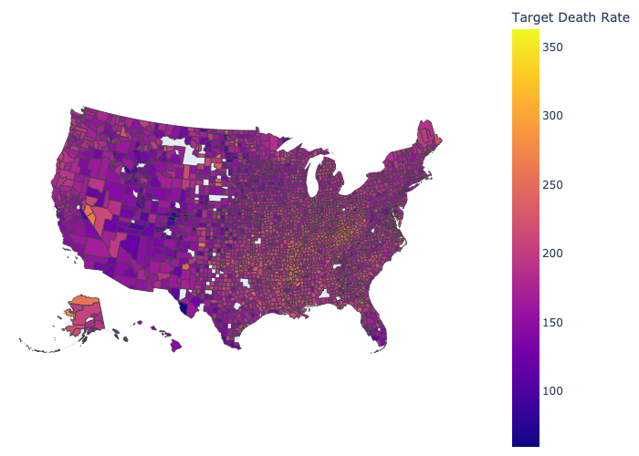
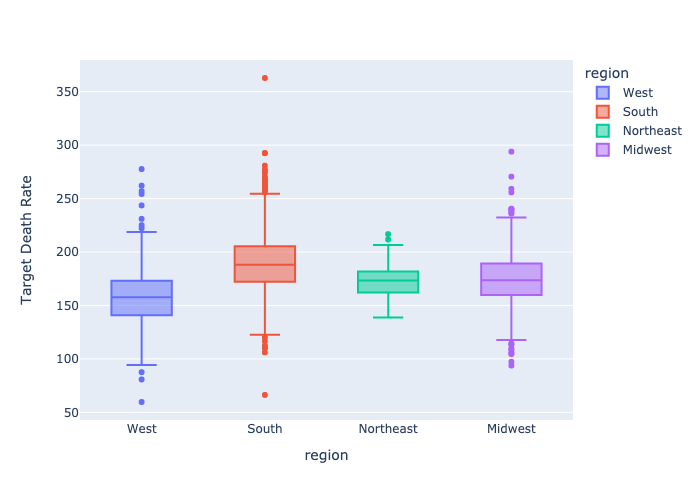
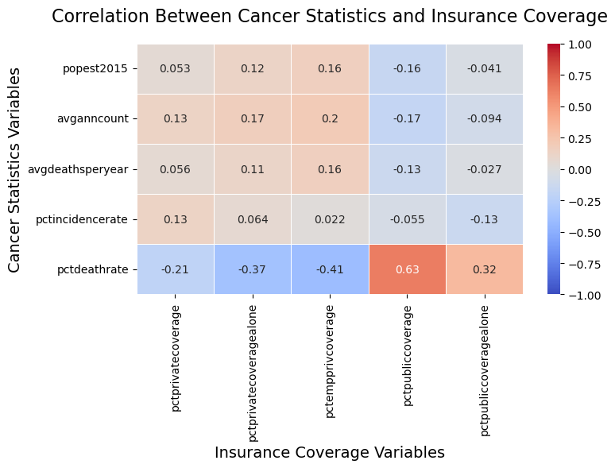
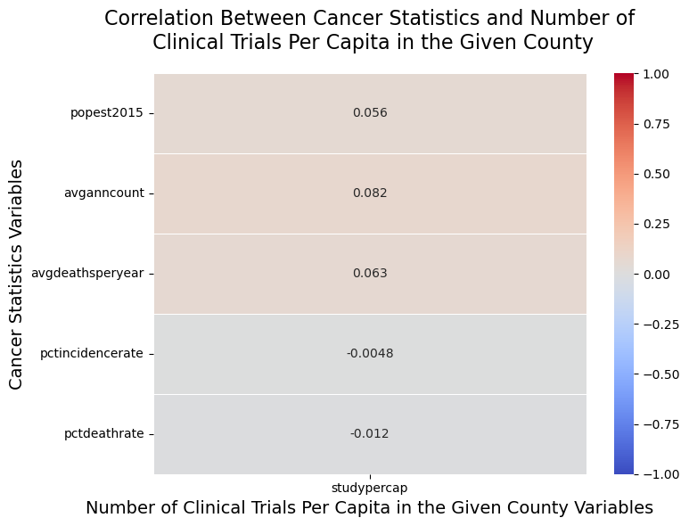
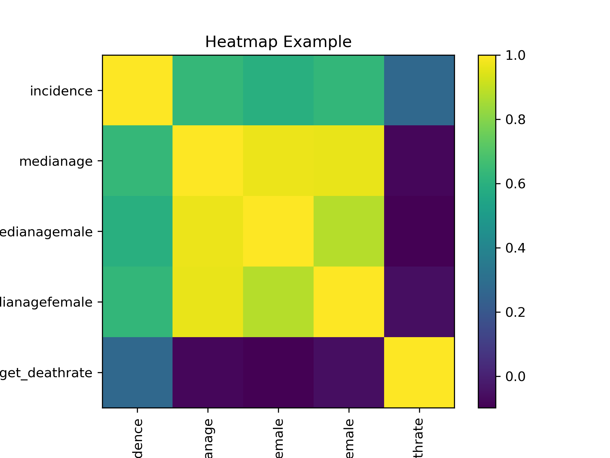
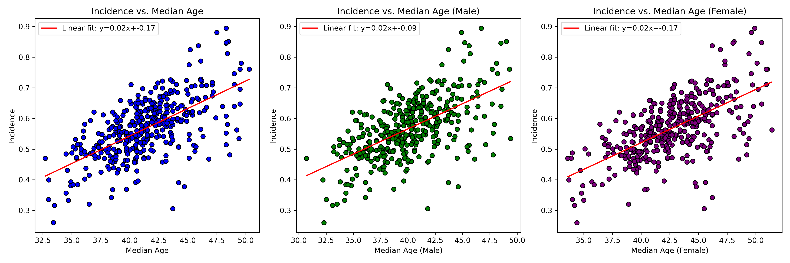

# About The Project
> GitHub README file includes a concise project overview (2 points).

This project performs an exploratory data analysis on a Kaggle dataset that includeds an abundant set of socioeconomic and demographic factors.
The analysis will examine how these factors influence health outcomes.

# Getting Started
> GitHub README file includes detailed usage and installation instructions (2 points).

## Installation

### For Unix (Linux/MacOS)

1. Open your terminal.
2. Run the following command:
```bash
git clone https://github.com/jordanskesner/plotters-against-cancer.git
```

## Usage
1. Start Jupyter Notebook from the project directory.
2. Open the relevant `.ipynb` notebook files to explore and run the analysis.

# Findings
> GitHub README includes either examples of the application, or the results and a summary of the analysis

1. The cancer mortality rate shows a moderate negative correlation with the percentage of people over 25 whose highest education obtained is a bachelor's degree.


2. The cancer mortality rate shows a moderate positive correlation with the percentage of people over 25 whose highest education obtained is a high school diploma.


3. Populations with higher median income have lower death rates.


4. The South exhibits the highest cancer mortality rates across the United States.



7. Insurance coverage types may have a significant impact on cancer death rates, with public insurance showing a stronger positive correlation with higher cancer death rates.


6. The number of clinical trials per capita has a weak correlation with cancer statistics, suggesting that other factors may play a more significant role in influencing cancer outcomes.


7. There is a strong correlation between cancer incidence and median age, with a correlation coefficient of 0.63 overall, 0.59 for median male age, and 0.62 for median female age.




# Acknowledgments

This project utilizes the [Uncovering Trends in Health Outcomes and Socioeconomic Factors dataset](https://www.kaggle.com/datasets/thedevastator/uncovering-trends-in-health-outcomes-and-socioec/data) available on Kaggle.

Most of the data preparation process can be viewed [here](https://data.world/nrippner/cancer-trials).

# Contributors


