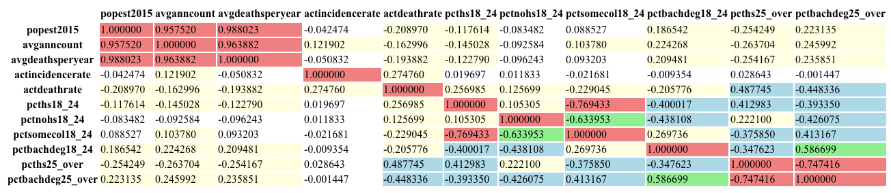

# YifeiProject1

## Overview

This project focuses on analyzing the relationship between cancer statistics and various types of health insurance coverage across different counties. The analysis includes data cleaning, correlation analysis, and visual exploration to understand how different types of health coverage relate to cancer death rates.

## Project Structure

- **YifeiProject1.ipynb**: The main Jupyter notebook where the data cleaning, analysis, and visualization are performed.
- **Data Files**:
  - `avg-household-size.csv`
  - `cancer_reg.csv`
- **Figures**: Individual figures generated from the analysis are stored in the `figures` folder.

## Data Cleaning

Missing values in the dataset were handled by filling in the blanks with the mean of the respective columns. This approach ensured that no rows were eliminated from the dataset, preserving as much information as possible for analysis.

## Analysis and Visualization

The analysis includes:
- **Correlation Heatmap**: To identify relationships between cancer statistics and insurance coverage.
- **Linear Regression Plots**: To explore the strength and direction of the relationships between key variables.
- **Box Plots with Data Points**: To visualize the distribution and potential outliers in the insurance coverage data.
- **Skewness and Kurtosis Analysis**: To confirm that the observed correlations are not the result of skewed data distributions.

## Supplementary Information

To ensure the robustness of the correlations observed, supplementary figures and analyses were included to verify that the relationships identified were not artifacts of skewed data or missing values.

## Instructions for Running the Notebook

1. Load the notebook `YifeiProject1.ipynb` in Jupyter.
2. Ensure that the data files (`avg-household-size.csv` and `cancer_reg.csv`) are in the same directory as the notebook.
3. Run the notebook cells sequentially to perform the data cleaning, analysis, and generate the visualizations.

## How to Save Figures

Each figure generated in the notebook can be saved as an individual file. To do this, add the following line after each plotting command:

```python
plt.savefig('figures/figure_name.png')

# About The Project
> GitHub README file includes a concise project overview (2 points).

This project performs an exploratory data analysis on a Kaggle dataset that includeds an abundant set of socioeconomic and demographic factors.
The analysis will examine how these factors influence health outcomes.

# Getting Started
> GitHub README file includes detailed usage and installation instructions (2 points).

## Installation

### For Unix (Linux/MacOS)

1. Open your terminal.
2. Run the following command:
```bash
git clone https://github.com/jordanskesner/plotters-against-cancer.git
```

## Usage
1. Start Jupyter Notebook from the project directory.
2. Open the relevant `.ipynb` notebook files to explore and run the analysis.

# Findings
> GitHub README includes either examples of the application, or the results and a summary of the analysis

1. The cancer mortality rate shows a moderate negative correlation with the percentage of people over 25 who hold a Bachelor's degree.



# Acknowledgments

This project utilizes the [Uncovering Trends in Health Outcomes and Socioeconomic Factors dataset](https://www.kaggle.com/datasets/thedevastator/uncovering-trends-in-health-outcomes-and-socioec/data) available on Kaggle.

Most of the data preparation process can be viewed [here](https://data.world/nrippner/cancer-trials).

# Contributors


