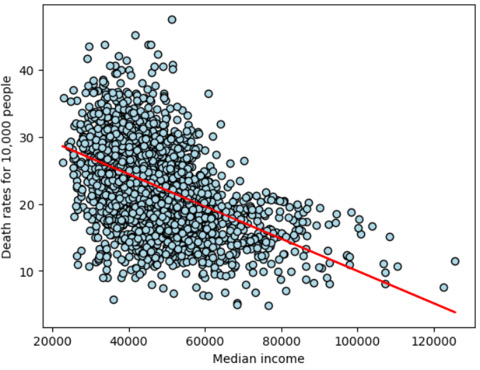
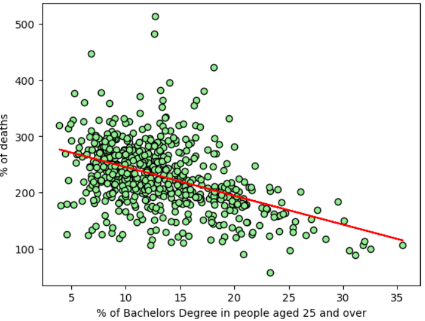
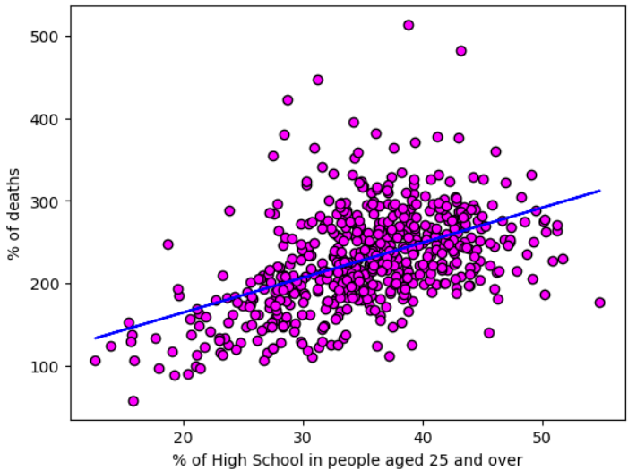
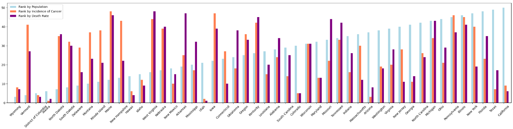

# Week 9 Kala Project 1 Notebook - Plotters Against Cancer

## Analyze relationships between cancer incidence and death rates AND education and income across all states and counties in the US

### Data Source - https://www.kaggle.com/datasets/thedevastator/uncovering-trends-in-health-outcomes-and-socioec

### Questions for exploration
1. Is there a relationship between cancer incidence and death rates AND income or poverty level?
1. Is there a relationship between cancer incidence and death rates AND educational level?
1. Do some states have lower rates of cancer incidences and death?

### Step 1: Read the 2 data csvs and clean the data.
* Read avg-household-size.csv, drop the column called index, create a new column called state using the geography column.
* Read cancer-reg.csv, drop the column called index.
* Merge the two csvs on column geography and remove rows where avganncount column = 1962.667684 as this data is incorrect.
* Recalculate actual incidence and death rates as the original columns target_deathrate and incidencerate seem incorrect.

### Step 2: Analyze relationships between cancer incidence and death rates AND education and income metrics.
#### 2A Analyze income and cancer.
* Looked at correlation between income and cancer rates. 
* Median income has moderate negative correlation to death rates.
* Plot the linear regression between median income and cancer deaths.

#### 2A Analyze income and education.
* Looked at correlation between education and cancer rates. 
* Moderate negative correlation between death rates and Bachelor's Degree for people aged 25 and over.
* Plot the linear regression between death rates and bachelor's degree.
* Moderate negative correlation between death rates and High School for people aged 25 and over, so plotting this linear regression.

### Step 3: Analyze data by US state.
* Group data by the new state column.
* Rank states in ascending order by population, cancer incidence and death rates.
* Combine all the ranks in one DataFrame and plot the bar graphs of the 3 ranks.
* Note that California has the largest population but a low rank of 9 and 6 for cancer incidence and death rates.
* Note that Vermont has a small population (rank 4), but high ranks for cancer incidence and death - 41 and 27 respectively.

### Conclusions:
* Populations with higher median income have lower death rates.
* Populations that have a greater percentage of people over 25 with a Bachelor's degree will see lower percentage of cancer deaths.  The reverse is also moderately true. Populations that have a greater percentage of people over 25 with only a high school degree will see higher percentage of cancer deaths.